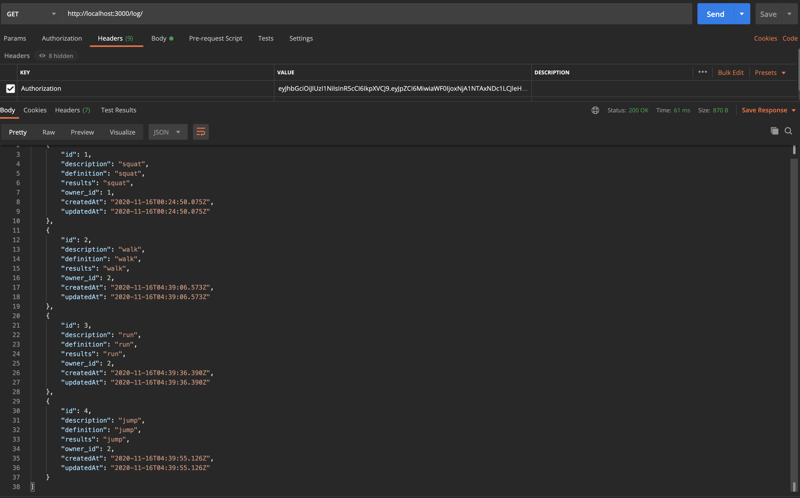
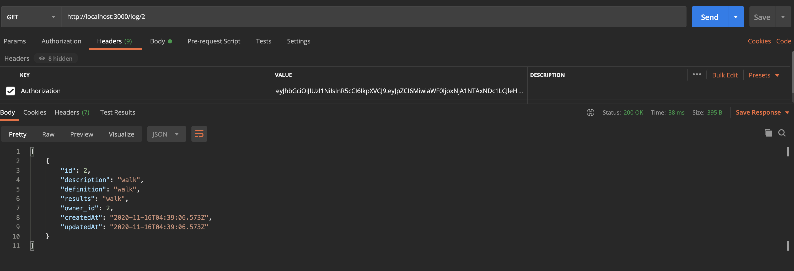

# workoutLog

This image shows that we do have to have an authorization key to be able to view user info.

This shows the chart on pgAdmin of log.js, after the delete done below.

This shows all the logs created by an individual user (user 2).

This shows we've deleted a log.

This shows log 2 by this specific user.

This shows we've updated a log by this specific user.

This shows this user created a log.

This is the chart for user.js and shows the username and the hashed password.

This shows that this specific user was able to log in.

This shows that we've registered/created a new user. 
